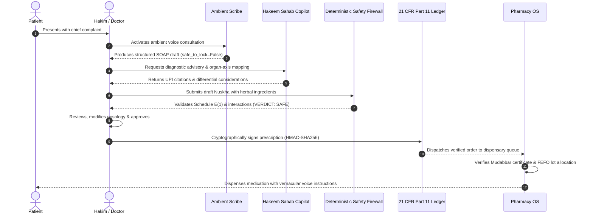

# ZAYVORA Health OS™ — Clinical Data Flow

## Longitudinal Consultation Data Lifecycle

```mermaid
sequenceDiagram
    autonumber
    actor Patient
    actor Doctor as Hakim / Doctor
    participant Scribe as Ambient Scribe
    participant AI as Hakeem Sahab Copilot
    participant Firewall as Deterministic Safety Firewall
    participant Audit as 21 CFR Part 11 Ledger
    participant Pharmacy as Pharmacy OS
    
    Patient->>Doctor: Presents with chief complaint
    Doctor->>Scribe: Activates ambient voice consultation
    Scribe-->>Doctor: Produces structured SOAP draft (safe_to_lock=False)
    Doctor->>AI: Requests diagnostic advisory & organ-axis mapping
    AI-->>Doctor: Returns UPI citations & differential considerations
    Doctor->>Firewall: Submits draft Nuskha with herbal ingredients
    Firewall-->>Doctor: Validates Schedule E(1) & interactions (VERDICT: SAFE)
    Doctor->>Doctor: Reviews, modifies posology & approves
    Doctor->>Audit: Cryptographically signs prescription (HMAC-SHA256)
    Audit-->>Pharmacy: Dispatches verified order to dispensary queue
    Pharmacy->>Pharmacy: Verifies Mudabbar certificate & FEFO lot allocation
    Pharmacy-->>Patient: Dispenses medication with vernacular voice instructions
```
