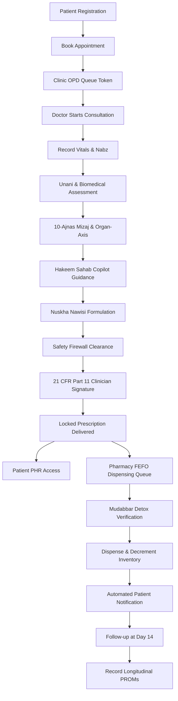

# ZAYVORA Health OS™ — Core Workflow Map

```mermaid
graph TD
    A[Patient Registration] --> B[Book Appointment]
    B --> C[Clinic OPD Queue Token]
    C --> D[Doctor Starts Consultation]
    D --> E[Record Vitals & Nabz]
    E --> F[Unani & Biomedical Assessment]
    F --> G[10-Ajnas Mizaj & Organ-Axis]
    G --> H[Hakeem Sahab Copilot Guidance]
    H --> I[Nuskha Nawisi Formulation]
    I --> J[Safety Firewall Clearance]
    J --> K[21 CFR Part 11 Clinician Signature]
    K --> L[Locked Prescription Delivered]
    L --> M[Patient PHR Access]
    L --> N[Pharmacy FEFO Dispensing Queue]
    N --> O[Mudabbar Detox Verification]
    O --> P[Dispense & Decrement Inventory]
    P --> Q[Automated Patient Notification]
    Q --> R[Follow-up at Day 14]
    R --> S[Record Longitudinal PROMs]
```
